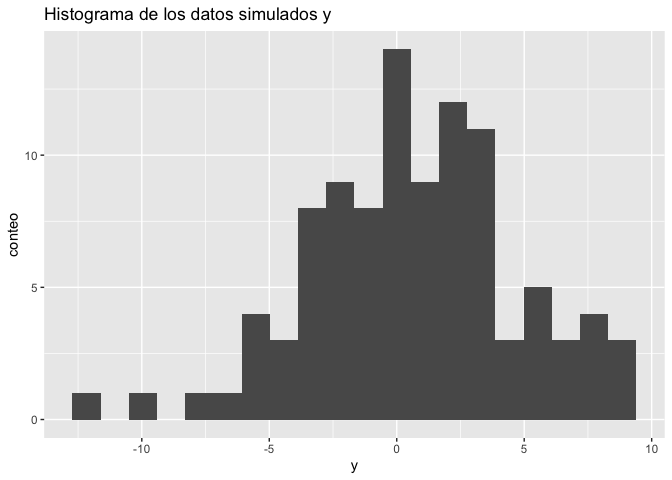
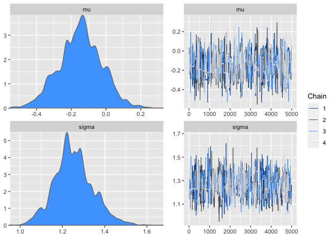
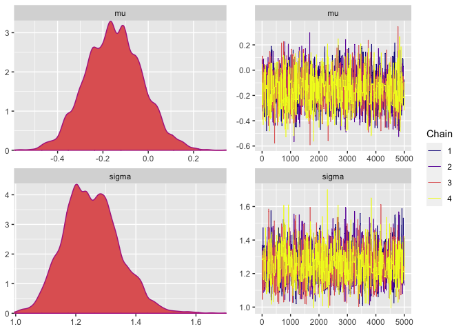
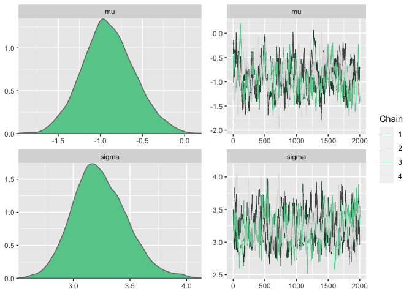
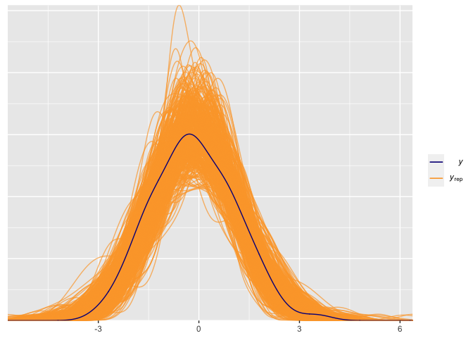

    source("functions.R")

    library(posterior)
    library(bayesplot)
    library(ggplot2)
    library(loo)

Este cuaderno hace un prueba de la funcionalidad del algortimo de
Metropolis implementado en el archivo `functions.R`, en este experimento
se simularan datos de una normal univariada mediante las siguientes
ecuaciones

$$
y = \mu + \sigma \varepsilon, \quad \varepsilon \sim N(0,1),\\
\mu \sim N(0,1), \quad \sigma \sim logN(1,1).
$$

Los datos se simulan mediante el siguiente codigo:

    #priors
    mu = rnorm(1)
    sigma = rlnorm(1,meanlog = 1)
    # datos
    y = rnorm(n = 100,mean = mu,sd = sigma)

    ggplot(data.frame(y),aes(x = y))+geom_histogram(bins = 20)+
      labs(x = "y",y = "conteo",title = "Histograma de los datos simulados y")

Ahora bien, previo a la estimacion de los parametros, actualizamos las
funciones `loglik()`, `log_prior()` y `inits()` para que calculen la
verosimilitud, el logaritmo de la prior y valores iniciales, de forma
correcta. Estas funciones son necesarias para el salto de metropolis
(`metropolis_step`) y para la iniciacion correcta del algoritmo
(`metropolis_sampler()`).

    # Estimacion de la log-verosimilitud
    loglik <- function(y,theta){
        d = sum(dnorm(x = y,mean = theta[1],sd = theta[2],log = TRUE))
        d = ifelse(is.na(d),-10^(64),d)
       return(sum(d))
    }

    # Calculo de la log prior logP(theta)
    log_prior <- function(theta){
      d1 = dnorm(theta[1],log = TRUE)
      d2 = dlnorm(theta[2],meanlog = 1,log = TRUE)
      return(d1 + d2)
    }

    # Generacion de los valores iniciales
    inits <- function(y,d = 2){
      c(rnorm(1),rlnorm(1,meanlog = 1))
    }

Ahora bien, procedemos a generar nuestras cadenas de Markov usando el
algoritmo de Metropolis. En este caso la funcion de salto es una normal
multivariada simetrica
*p**r**o**p**o**s**e**d* ∼ *N*2(*p**r**o**p*,*d**i**a**g*(1,1)),
con matriz de covarianza siendo la matriz identidad. Se generaron 4
cadenas de Markov de un total de 10,000 iteraciones por cadena
(`iter = 10,000`), donde se eliminaron las primeras 2,000 iteraciones
(`burn-in = 2500`), y se acortaron las cadenas con un `thinning` de cada
5 saltos (`thin = 5`) para evitar que las cadenas se quedaran
estancadas.

    scale_mat  = diag(c(1,1))

    start = Sys.time()
    post1 = sampling(y,iter = 5000, scale = scale_mat, thin = 3)
    print( Sys.time() - start)

    ## Time difference of 6.46065 secs

Los resultados obtenidos muestran convergencia en las cadenas *R̂* ≈ 1,
pero los tamaños de muestra efectivos son lo muy bajos, como para
aceptar las simulaciones obtenidas. Notemos que las posteriors si
recuperaron los valores reales de *μ* (-0.5150566) y *σ* (1.1767894),
pero dada su poca convergencia no quantifican bien la incertidumbre de
los parametros.

    colnames(post1) = c("mu","sigma","accpetence_rate",".chain")
    post_df = as_draws_df(post1)

    summarise_draws(post_df)

    ## # A tibble: 3 × 10
    ##   variable         mean median     sd    mad     q5    q95  rhat ess_b…¹ ess_t…²
    ##   <chr>           <dbl>  <dbl>  <dbl>  <dbl>  <dbl>  <dbl> <dbl>   <dbl>   <dbl>
    ## 1 mu            -0.148  -0.144 0.123  0.121  -0.350 0.0484  1.01    752.    929.
    ## 2 sigma          1.25    1.25  0.0916 0.0818  1.10  1.41    1.01    979.   1087.
    ## 3 accpetence_r…  0.0217  0     0.146  0       0     0       1.00  19192.  19192.
    ## # … with abbreviated variable names ¹​ess_bulk, ²​ess_tail

La siguiente visualización muestra las posterios y cadenas para ambos
parametros, los cadenas quedan en puntos de acumulacion debido al bajo
ratio de rechazo y las posteriors son deformes, indicando que es
necesario realizar mas iteraciones.

    color_scheme_set("mix-gray-brightblue")
    mcmc_combo(post_df,pars = c("mu","sigma"))

## Adjusted scale metropolis

Una alternativa a aumentar el numero de iteraciones es controlar el
factor de escala de la cadena, para eso haremos un algoritmo de
Metropolis-Hastings con factor de escala ajustado, en este caso la
distribution de salto es:

$$x\_k = x\_{k-1} + \sqrt h \Sigma^{1./2} \varepsilon, \quad \varepsilon \sim N\_d(0,I).$$
Donde *h* es el factor de escala que corrige la matriz de covarianza
*Σ*, y d es la dimension de los parametros a obtener (*x*). Un mejor
control de *h* aumentaria la tasa de aceptacion del MCMC. para este caso
elegimos *h* = 0.01 y reducimos el acortamiento a 1

    scale_mat  = diag(c(1,1))

    start = Sys.time()
    post1 = sampling(y,iter = 5000, scale = scale_mat, thin = 1, h = 0.1)
    print( Sys.time() - start)

    ## Time difference of 2.817429 secs

El tiempo de ejecucion se ve reducido, ademas que la convergencia y
tamaño de las cadenas es mejor con respecto al tiempo anterior, y la
tasa de acceptacion incremento.

    colnames(post1) = c("mu","sigma","accpetence_rate",".chain")
    post_df = as_draws_df(post1)

    summarise_draws(post_df)

    ## # A tibble: 3 × 10
    ##   variable         mean median     sd    mad     q5    q95  rhat ess_b…¹ ess_t…²
    ##   <chr>           <dbl>  <dbl>  <dbl>  <dbl>  <dbl>  <dbl> <dbl>   <dbl>   <dbl>
    ## 1 mu             -0.151 -0.153 0.124  0.127  -0.356 0.0549  1.00   1549.   2063.
    ## 2 sigma           1.25   1.25  0.0923 0.0903  1.11  1.41    1.00   2000.   2145.
    ## 3 accpetence_ra…  0.160  0     0.367  0       0     1       1.00  16057.     NA 
    ## # … with abbreviated variable names ¹​ess_bulk, ²​ess_tail

La siguiente visualización muestra las posterios y cadenas para ambos
parametros, las cadenas se visualizan estacionaria y las posteriors
menos deformes, indicando convergencia.

    color_scheme_set("viridisC")
    mcmc_combo(post_df,pars = c("mu","sigma"))

Para una mayor tasa de rechazo se puede incrementar el tamanio de
muesta, mejorar el factor de escala, o intentar un MCMC adaptativo.

## Metropolis adjusted Lavengin algorithm

El siguiente algoritmo, hace el salto de la cadena mediante un descenso
en gradiente, de tal forma que el la funcion de salto sea normal
simetrica, el salto se describe mediante la siguiente ecuación

$$x\_k = x\_{k-1} + h \Sigma \nabla \log f(x\_{k-1})/2 +  \sqrt{h} \Sigma^{1/2}\varepsilon, \quad \varepsilon \sim N\_d(0,I)$$

En este caso *Σ* es la matriz de covarianza de la funcion de salto, h es
el factor de escala, log *f* es el logaritmo de la funcion objetivo tal
que *f*(*x*) ∝ *l**i**k**e**l**i**h**o**o**d*(*x*)*π*(*x*), y ∇ es el
gradiente de una funcion. Se sabe que cuando estos algoritmos usan un
factor de escala optimo, el salto es ergodico y la tasa de aceptación es
de alrededor de *r* ≈ 0.56. Empiricamente, se sabe que el factor de
escala optimo esta en la region 0 &lt; *h* &lt;  &lt; 1.

El siguiente codigo genera 2000 iteraciones de un MALA con un warm-up de
1000 iteraciones, sin acortamiento, y una matriz de covarianza con
diagonal 1, y 0.1 de covarianza. El factor de escala en este caso es
bastante cercano a 0, *h* = 0.01.

    scale_mat = matrix(c(1,0.1,0.1,1),nrow = 2)

    start = Sys.time()
    post2 = sampling(y,iter = 2000, scale = scale_mat, thin = 1, h = 0.01,MALA = TRUE)
    print( Sys.time() - start)

    ## Time difference of 12.6727 secs

Aunque los tiempos de ejecución incrementaron debido al computo de los
gradientes, el metodo solo duplico el tiempo de ejecucion alcanzando la
convergencia con menos iteraciones que los primeros dos. Donde los
factores de convergencia y tamños de muestra efectivos se indican
convergencia y la tasa de aceptación es mucho mayor que la de los
metodos anteriores y cercana a la optima.

    colnames(post2) = c("mu","sigma","accpetence_rate",".chain")
    post_df = as_draws_df(post2)

    summarise_draws(post_df)

    ## # A tibble: 3 × 10
    ##   variable         mean median     sd    mad     q5    q95  rhat ess_b…¹ ess_t…²
    ##   <chr>           <dbl>  <dbl>  <dbl>  <dbl>  <dbl>  <dbl> <dbl>   <dbl>   <dbl>
    ## 1 mu             -0.143 -0.145 0.125  0.126  -0.344 0.0661  1.00    637.   1157.
    ## 2 sigma           1.25   1.24  0.0894 0.0879  1.11  1.40    1.00   1116.   1522.
    ## 3 accpetence_ra…  0.600  1     0.490  0       0     1       1.00   7777.     NA 
    ## # … with abbreviated variable names ¹​ess_bulk, ²​ess_tail

Los graficos indican que las cadenas son ergodicas y las posteriors son
unimodales y simetricas indicando convergencia y una buena
cuantificacion de la incertidumbre de los parametros.

    color_scheme_set("mix-gray-green")
    mcmc_combo(post_df,pars = c("mu","sigma"))

## Posterior predictive checks

Revisar el ajuste de los datos es una buena praxis para validar los
supuestos del modelo, para eso es necesario realizar posterior
predictive checks. En este caso, extraemos 500 simulaciones aleatorias,
y las comparamos con los datos reales. El grafico siguiente muestra que
el modelo provee un buen ajuste de los datos.

    color_scheme_set("viridisC")

    y_rep = apply(post1,1,FUN = function(x){
      x = as.numeric(x)
      rnorm(n = 100,mean = x[1],sd = x[2])
    })

    s = sample(1:2000,size = 500)
    ppc_dens_overlay(y = y,yrep = t(y_rep)[s,])

Finalmente, realizamos validacion cruzada para determinar el ajuste del
modelo, para eso es necesario computar la matriz de de
log-verosimilitud, al aproximar la elpd (Expected log-predictive
density) notamos que no hay advertencias de un mal ajusto de los valores
de pareto, por lo tanto aceptamos el modelo propuesto.

    log_lik <- function(y,theta) {
      t(apply(theta,1,function(theta)
       dnorm(x = y,mean = theta[1],sd = theta[2],log = TRUE)
      ))
    }
    LL = log_lik(y,post1)

    loo1 = loo(LL, relative_eff(exp(LL)))
    loo1

    ## 
    ## Computed from 20000 by 100 log-likelihood matrix
    ## 
    ##          Estimate   SE
    ## elpd_loo   -164.7  6.9
    ## p_loo         1.9  0.4
    ## looic       329.5 13.7
    ## ------
    ## Monte Carlo SE of elpd_loo is 0.0.
    ## 
    ## All Pareto k estimates are good (k < 0.5).
    ## See help('pareto-k-diagnostic') for details.
