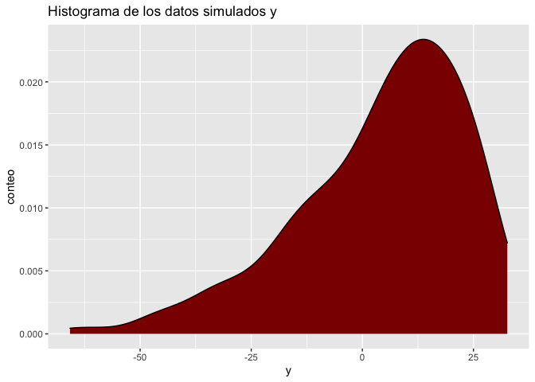
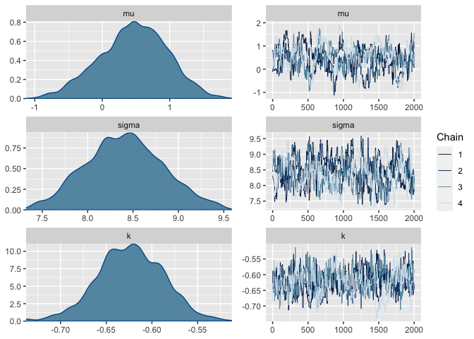
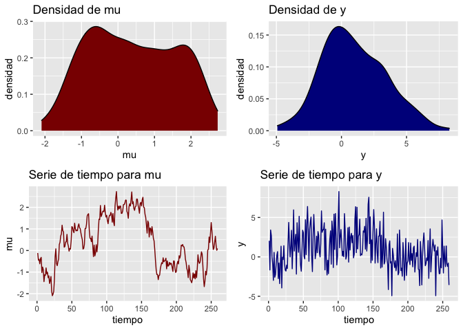
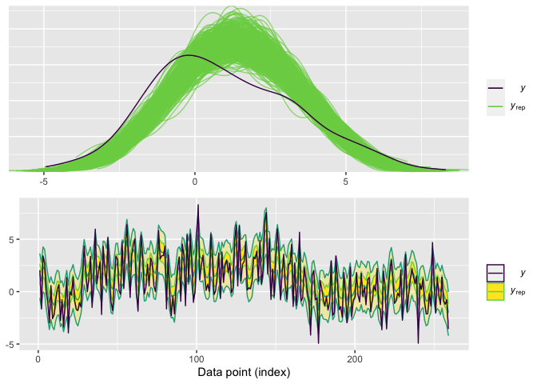
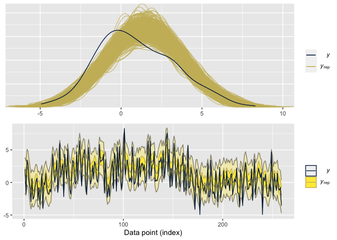

    source("Funciones/functions.R")

    library(cowplot)
    library(posterior)
    library(bayesplot)
    library(ggplot2)
    library(loo)

Este cuaderno hace un prueba de la funcionalidad del algoritmo de Metropolis implementado en el archivo `functions.R`, en este experimento se simularan datos de una normal univariada mediante las siguientes ecuaciones

$$
y  \sim GEV(\mu,\sigma,\alpha),\\
\mu \sim N(0,1), \quad \sigma \sim logN(1,1) \ k \sim beta(2,2).
$$

Los datos se simulan mediante el siguiente codigo:

    eff_seed <- sample(1:2^15, 1)
    set.seed(25746)

    #priors
    preal = c(rnorm(1),rlnorm(1,meanlog = 0.1),rnorm(1))

    # datos
    y = SpatialExtremes::rgev(259,preal[1],scale = preal[2],shape = preal[3])

    ggplot(data.frame(y),aes(x = y))+geom_density(fill = "darkred")+
      labs(x = "y",y = "conteo",title = "Histograma de los datos simulados y")

Ahora bien, previo a la estimacion de los parametros, actualizamos las funciones `loglik()`, `log_prior()` y `inits()` para que calculen la verosimilitud, el logaritmo de la prior y valores iniciales, de forma correcta. Estas funciones son necesarias para el salto de Metropolis (`metropolis_step`) y para la iniciacion correcta del algoritmo (`metropolis_sampler()`). 

    # Estimacion de la log-verosimilitud
    loglik <- function(y,theta){
        d = SpatialExtremes::dgev(y,loc = theta[1],scale = theta[2],
                                  shape = theta[3],log = TRUE)
        return(sum(d))
    }

    # Calculo de la log prior logP(theta)
    log_prior <- function(theta){
      d1 = dnorm(theta[1],log = TRUE)
      d2 = dt(theta[2],df = 3,log = TRUE) + log(2)
      d3 = dnorm(theta[3],log = TRUE)
      return(d1+d2+d3)
    }

    # Generacion de los valores iniciales
    inits <- function(){
      c(rnorm(1),rlnorm(1),rnorm(1))
    }

Ahora bien, procedemos a generar nuestras cadenas de Markov usando el algoritmo de Metropolis. En este caso la función de salto es una normal multivariada simétrica $proposed \sim N_2(prop,diag(1,1))$, con matriz de covarianza siendo la matriz identidad. Se generaron 4 cadenas de Markov de un total de 10,000 iteraciones por cadena (`iter = 10,000`), donde se eliminaron las primeras 2,000 iteraciones (`burn-in = 2000`), y se aceptaron los saltos de cada 5 tiempos (`lag = 5`) para evitar que las cadenas se quedaran estancadas.

    set.seed(9564)

    post1 = sampling(y = y, scale = 5*diag(3), iter = 2000,thin = 5,
                     h = 0.01, positive = 2, refresh = 0)

    ## Time difference of 8.072687 secs

Los resultados obtenidos muestran convergencia en las cadenas $\hat R \approx 1$, y los tamaños de muestra efectivos son lo suficientemente grandes, como para aceptar las simulaciones obtenidas. Notemos que las posterior recuperaron los valores reales de $\mu$ (0.4769593), $\sigma$ (8.44622) y  $k$ (-0.6363073).

    colnames(post1) = c(".chain","acceptance_rate","mu","sigma","k")
    post1_df = as_draws_df(post1)
    summarise_draws(post1_df)

    ## # A tibble: 4 × 10
    ##   variable         mean median     sd    mad     q5    q95  rhat ess_b…¹ ess_t…²
    ##   <chr>           <dbl>  <dbl>  <dbl>  <dbl>  <dbl>  <dbl> <dbl>   <dbl>   <dbl>
    ## 1 acceptance_ra…  0.270  0     0.444  0       0      1      1.00  7201.      NA 
    ## 2 mu              0.462  0.480 0.500  0.501  -0.421  1.26   1.08    68.1    149.
    ## 3 sigma           8.41   8.41  0.425  0.425   7.73   9.12   1.06   102.     399.
    ## 4 k              -0.623 -0.623 0.0361 0.0368 -0.683 -0.565  1.02   174.     188.
    ## # … with abbreviated variable names ¹​ess_bulk, ²​ess_tail

Ademas, las cadenas y densidades de las posterioris muestran que las cadenas se mezclaron y no se observa multi-modalidad, por lo tanto aceptamos las simulaciones obtenidas del algoritmo.

    mcmc_combo(post1_df,pars = c("mu","sigma","k"))

Revisar el ajuste de los datos es una buena praxis para validar los supuestos del modelo, para eso es necesario realizar posterior predictive checks. En este caso, extraemos 500 simulaciones aleatorias, y las comparamos con los datos reales. El gráfico siguiente muestra que el modelo provee un buen ajuste de los datos.

    color_scheme_set("viridisC")

    y_rep = apply(post1,1,FUN = function(x){
      x = as.numeric(x)
      SpatialExtremes::rgev(259,loc = x[3],scale = x[4],shape = x[5])
    })

    s = sample(1:8000,size = 500)
    y_rep_try = t(y_rep)[s,]

    ppc_dens_overlay(y = y,yrep = y_rep_try)

Realizamos validacion cruzada para determinar el ajuste del modelo, para eso es necesario computar la matriz de de log-verosimilitud, al aproximar la elpd (Expected log-predictive density) notamos que no hay advertencias de un mal ajusto de los valores de pareto, por lo tanto aceptamos el modelo propuesto.

    log_lik <- function(y,theta) {
     t(apply(theta,1,function(theta)
        SpatialExtremes::dgev(y,loc = theta[3],scale = theta[4],
                                  shape = theta[5],log = TRUE)
      ))
    }
    LL  = log_lik(y,post1)

    loo1 = loo(LL, relative_eff(exp(LL)))
    loo1

    ## 
    ## Computed from 8000 by 259 log-likelihood matrix
    ## 
    ##          Estimate   SE
    ## elpd_loo   -866.4 11.2
    ## p_loo         1.9  0.3
    ## looic      1732.7 22.4
    ## ------
    ## Monte Carlo SE of elpd_loo is 0.0.
    ## 
    ## All Pareto k estimates are good (k < 0.5).
    ## See help('pareto-k-diagnostic') for details.

## Modelos GEV con estructuras temporales

En este caso ajusta un modelo que sigue una distribución GEV con una estructura lineal temporal para medir las dependencias entre los datos a traves del tiempo. Para eso modificaremos el modelo original agregando una ecuación adicional al parámetro de locación para que esta se adapte a la estructura temporal.

$$
 y\_t  \sim GEV(\mu\_t,\sigma, k),\\
 \mu\_t = G \mu\_{t-1} + w\_t, \quad w\_t \sim N(0,W);\\
 \sigma \sim \text{half-t}(5) \quad k \sim N(0,1),\\
$$

Los datos se simulan mediante el siguiente código:

    eff_seed <- sample(1:2^15, 1)
    set.seed(27482)

    n = 259
    preal = c(rlnorm(1,meanlog = 0.1),rnorm(1))
    y0 = rdlm(n = n, W = 0.1)

    y = SpatialExtremes::rgev(n = n,loc = y0$mt[-1],scale = rep(preal[1],n),preal[2])

    g1 = plot_ts(y0$mt[-1],name = "mu")

    ## Registered S3 method overwritten by 'quantmod':
    ##   method            from
    ##   as.zoo.data.frame zoo

    g2 = plot_ts(y, name = "y",color = "darkblue")
    cowplot::plot_grid(g1,g2,ncol = 2)

 

Para simular los datos primero simulamos las locaciones en cada tiempo usando un $DLM(G = 1, F = 1,V =1, W = 0.1)$ constante, extraemos los valores de $\mu_t$, para simular las observaciones mediante la ecuación la anterior y los parametros de escala y forma se simularon con variables lognormal y normal estandard respectivamente.

## Estimacion del modelo:

Una forma simple de ajustar el modelo es extraer una muestra para la posterior marginal de $\mu_1,\mu_2,\ldots,\mu_n | y,\sigma, k$ mediante el algoritmo de `Forward Filtering Backward Sampling` asumiendo una aproximación normal, ajustar la media a posteriori y ajustar un algoritmo de `Metropolis-Hastings` para las otros dos parámetros restantes.

Al aplicar el filtro tenemos:

    mu_post = ffbs(y,C0 = 100,iter = 1000)

    color_scheme_set("teal")
    ppc_ribbon(y = y0$mt[-1],yrep = mu_post$ft[, ,1])

El grafico anterior muestra un buen ajuste a la media de los datos, pese que los valores para $G$ y $W$ son distintos a los usados para simular los datos. Previo al ajuste del metropolis es necesario definir las prioris y los valores iniciales con las que se iniciaran las cadenas de Markov. En este caso se utilizara una densidad t-student con 3 grados de libertad para la escala del modelo y una densidad normal estandar. Para generar valores iniciales utilizaremos una densidad log-normal para la scala y una normal estandard para la forma.

$$
\sigma \sim \text{half-t}(5).\\
k \sim N(0,1).
$$

Es importante resaltar que la student-t debe solo tomar valores positivos, y estas densidades definidas en la mitad de su dominio se les conoce como densidades medias (*half-student-t*).

    loglik <- function(y,theta){
      d = SpatialExtremes::dgev(y, loc = 0, scale = theta[1],
                        shape = theta[2], log = TRUE)
      return(sum(d))
    }

    # Calculo de la log prior logP(theta)
    log_prior <- function(theta){
      d2 = dt(theta[1],df = 3,log = TRUE) + log(2)
      d3 = dnorm(theta[2],sd = 1,log = TRUE)
      
      return(d2+d3)
    }

    # Generacion de los valores iniciales
    inits <- function(){
      c(rlnorm(1),rnorm(1))
    }

Ahora corremos el metropolis-hastings para los parametros faltantes, pero con los datos filtrados por la estimación a posterior de $\mu_1,\mu_2,\ldots, \mu_n | y$. En este caso se corren 4 cadenas de 5,000 iteraciones por cadena, donde las primeras 2,500 iteraciones se descartan por `warm-up`. 

**Importante:** la opción `positive = 1` indica que el primer parámetro solo acepta valores positivos, en caso de haber mas variables positivas indicarlas con un vector de posiciones. 

    set.seed(12121)

    mu_est = apply(mu_post$ft[, ,1],2,mean)

    post1 = sampling(y = y - mu_est, scale = 3*diag(2), iter = 5000, 
                     h = 0.005, positive = 1, refresh = 0)

    ## Time difference of 8.369957 secs

El cuadro resumen muestra que las cadenas han convergido  con tamaños de muestra efectivos aceptables y factores convergencia (Rhat) cercanos a 1, indicando convergencia. La tasa de aceptacion es baja pero aceptable para un algoritmo de Metropolis.

    colnames(post1) = c(".chain","acceptance_rate","sigma","k")
    post1_df = as_draws_df(post1)
    summarise_draws(post1_df)

    ## # A tibble: 3 × 10
    ##   variable         mean median     sd    mad     q5    q95  rhat ess_b…¹ ess_t…²
    ##   <chr>           <dbl>  <dbl>  <dbl>  <dbl>  <dbl>  <dbl> <dbl>   <dbl>   <dbl>
    ## 1 acceptance_ra…  0.234  0     0.423  0       0      1      1.00  15440.     NA 
    ## 2 sigma           1.36   1.36  0.0593 0.0600  1.27   1.46   1.00   1984.   2459.
    ## 3 k              -0.369 -0.371 0.0296 0.0287 -0.416 -0.318  1.00   2333.   2754.
    ## # … with abbreviated variable names ¹​ess_bulk, ²​ess_tail

Observamos que las densidad y las trazas de las cadenas, en ambos casos no se distinguen comportaminetos anómalos por lo tanto aceptamos el modelo.

    color_scheme_set("viridisB")
    mcmc_combo(post1_df,pars = c("sigma","k"))

Seguidamente realizamos `posterior predictive checks` para revisar el ajuste de nuestro modelo el siguiente algoritmo genera muestras de nuestro modelo usando las posteriors de nuestros parámetros y la media a posterior para las locaciones. Por costos computaciones, solo utilizaremos una muestra de 500 muestras que extraemos del MCMC para hacer revisar el ajuste.

    y_rep = apply(post1,1,FUN = function(x){
      x = as.numeric(x)
      SpatialExtremes::rgev(259,loc = 0,scale = x[3],shape = x[4]) + mu_est
    })

    s = sample(1:20000,size = 500)
    y_rep_try = t(y_rep)[s,]

    color_scheme_set("viridisD")
    g1 = ppc_dens_overlay(y = y,yrep = y_rep_try,trim = TRUE)
    g2 = ppc_ribbon(y = y,yrep = y_rep_try)

    cowplot::plot_grid(g1,g2,ncol = 1)

de los datos, pero se pudo recuperar el comportamiento temporal de los datos. Finalmente calculamos la log-verosimilitud y estimamos la log-predictiva usando validación cruzada. 

    log_lik <- function(y,theta) {
      t(apply(theta,1,function(theta)
        SpatialExtremes::dgev(y - mu_est, loc = 0, scale = theta[1],
                              shape = theta[2], log = TRUE)
      ))
    }

    LL  = log_lik(y,post1[,c(3,4)])

    loo1 = loo(LL, relative_eff(exp(LL)))
    loo1

    ## 
    ## Computed from 20000 by 259 log-likelihood matrix
    ## 
    ##          Estimate   SE
    ## elpd_loo   -453.1 10.5
    ## p_loo         1.5  0.6
    ## looic       906.2 21.1
    ## ------
    ## Monte Carlo SE of elpd_loo is 0.0.
    ## 
    ## Pareto k diagnostic values:
    ##                          Count Pct.    Min. n_eff
    ## (-Inf, 0.5]   (good)     258   99.6%   15858     
    ##  (0.5, 0.7]   (ok)         1    0.4%   3465      
    ##    (0.7, 1]   (bad)        0    0.0%   <NA>      
    ##    (1, Inf)   (very bad)   0    0.0%   <NA>      
    ## 
    ## All Pareto k estimates are ok (k < 0.7).
    ## See help('pareto-k-diagnostic') for details.

## Metropolis-FFBS completo

Una forma alternativa de correr el modelo es correr una iteracion de FFBS en cada salto de Metropolis. Para poder adaptar el algoritmo FFBS, es necesario pasar los argumentos del DLM asociado a las variables latentes.

Esto se realiza mediante el siguiente código: 

    set.seed(24596)

    dlm_temp = dlm::dlm(GG =1, FF = 1, V = 1, W = 1, m0 = 0, C0 = 100)

    post2 = sampling(y = y, scale = 3*diag(2),thin = 1, refresh = 0,iter = 1000, 
                     h = 0.005, positive = 1, add_dlm = dlm_temp)

    ## Time difference of 6.195522 mins

En este caso por cuestiones de computo solo se realizaron 1,000 iteraciones,  con tamaños de muestra efectivos un poco bajo (*indicando que se necesitan cadenas mas largas*) y factores convergencia (Rhat) cercanos a 1, indicando convergencia. La tasa de acceptación es mayor a la obtenida con el modelo incompleto. 

    colnames(post2) = c(".chain","acceptance_rate","sigma","k",paste0("mu",1:259))
    post2_df = as_draws_df(post2[,1:4])
    summarise_draws(post2_df)

    ## # A tibble: 3 × 10
    ##   variable         mean median     sd    mad     q5    q95  rhat ess_b…¹ ess_t…²
    ##   <chr>           <dbl>  <dbl>  <dbl>  <dbl>  <dbl>  <dbl> <dbl>   <dbl>   <dbl>
    ## 1 acceptance_ra…  0.461  0     0.499  0       0      1      1.00   3270.     NA 
    ## 2 sigma           1.56   1.55  0.127  0.112   1.37   1.78   1.00    383.    575.
    ## 3 k              -0.330 -0.334 0.0675 0.0594 -0.430 -0.213  1.00   1022.   1009.
    ## # … with abbreviated variable names ¹​ess_bulk, ²​ess_tail

Observamos que las densidad y las trazas de las cadenas, en ambos casos
no se distinguen comportaminetos anómalos por lo tanto aceptamos el
modelo.

    color_scheme_set("blue")
    mcmc_combo(post2_df,pars = c("sigma","k"))

Seguidamente realizamos `posterior predictive checks` para revisar el
ajuste de nuestro modelo el siguiente algoritmo genera muestras de
nuestro modelo usando las posteriors de nuestros parámetros y la media a
posterior para las locaciones. Por costos computaciones, solo
utilizaremos una muestra de 500 muestras que extraemos del MCMC para
hacer revisar el ajuste.

    y_rep = apply(post2,1,FUN = function(x){
      x = as.numeric(x)
      n = length(x)
      SpatialExtremes::rgev(259,loc = 0,scale = x[3],shape = x[4]) + x[5:n]
    })

    s = sample(1:4000,size = 500)
    y_rep_try = t(y_rep)[s,]

    color_scheme_set("viridisE")
    g1 = ppc_dens_overlay(y = y,yrep = y_rep_try,trim = TRUE)
    g2 = ppc_ribbon(y = y,yrep = y_rep_try)

    cowplot::plot_grid(g1,g2,ncol = 1)

El gráfico superior muestra que la sub-estimación de los parámetros de
forma y escala generan un ajuste pobre de la densidad de los datos, pero
se pudo recuperar el comportamiento temporal de los datos. Calculamos la
log-verosimilitud y estimamos la log-predictiva usando validación
cruzada.

    log_lik <- function(y,theta) {
      t(apply(theta,1,function(theta)
        SpatialExtremes::dgev(y - theta[5:length(theta)], loc = 0, scale = theta[3],
                              shape = theta[4], log = TRUE)
      ))
    }

    LL  = log_lik(y,post2)
    LL[is.infinite(LL)] = -600

    loo2 = loo(LL, relative_eff(exp(LL)))
    loo2

    ## 
    ## Computed from 4000 by 259 log-likelihood matrix
    ## 
    ##          Estimate     SE
    ## elpd_loo  -3009.1  843.7
    ## p_loo      2543.9  842.1
    ## looic      6018.3 1687.3
    ## ------
    ## Monte Carlo SE of elpd_loo is NA.
    ## 
    ## Pareto k diagnostic values:
    ##                          Count Pct.    Min. n_eff
    ## (-Inf, 0.5]   (good)     165   63.7%   1327      
    ##  (0.5, 0.7]   (ok)        44   17.0%   281       
    ##    (0.7, 1]   (bad)       15    5.8%   110       
    ##    (1, Inf)   (very bad)  35   13.5%   1         
    ## See help('pareto-k-diagnostic') for details.

Notamos que el ajuste por PISIS de la predictiva no se puede realizar
debido a que las estimaciones de la log-verosimilitud son no
determinadas para ciertos valores de la log-verosimilitud, por lo tanto
la predictiva logaritmica puede ser estimada por otros metodos como
Moment-matchingo sub-sampling.
