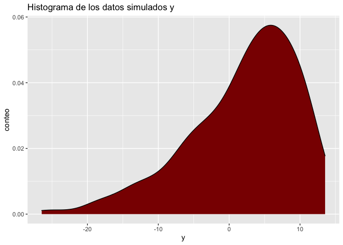
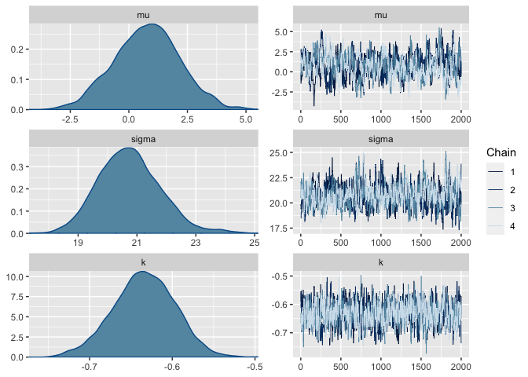
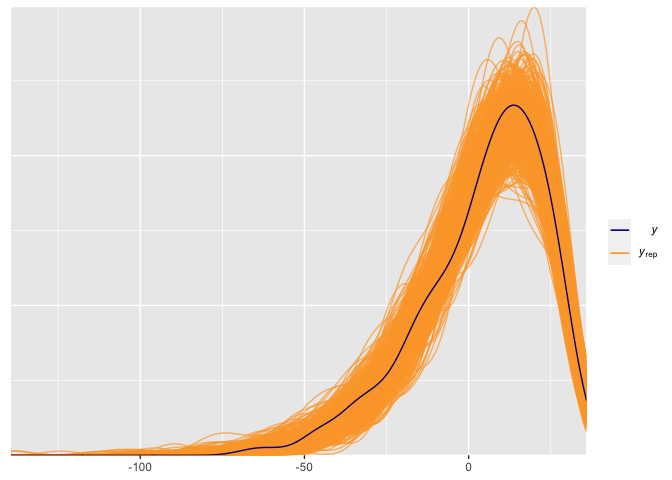

## Estimacion de un modelo GEV simple

    library(cowplot)
    library(posterior)
    library(bayesplot)
    library(ggplot2)
    library(loo)

Este cuaderno hace un prueba de la funcionalidad del algoritmo de
Metropolis implementado en el archivo `functions.R`, en este experimento
se simularan datos de una normal univariada mediante las siguientes
ecuaciones

$$
y  \sim GEV(\mu,\sigma,\alpha),\\
\mu \sim N(0,1), \quad \sigma \sim logN(1,1) \ k \sim rnom(0,1).
$$

Los datos se simulan mediante el siguiente codigo:

    eff_seed <- sample(1:2^15, 1)
    set.seed(25746)

    #priors
    preal = c(rnorm(1),rlnorm(1,meanlog = 1),rnorm(1))

    # datos
    y = SpatialExtremes::rgev(259,preal[1],scale = preal[2],shape = preal[3])

    ggplot(data.frame(y),aes(x = y))+geom_density(fill = "darkred")+
      labs(x = "y",y = "conteo",title = "Histograma de los datos simulados y")

Previo a la estimacion de los parametros, actualizamos las
funciones `loglik()`, `log_prior()` y `inits()` para que calculen la
verosimilitud, el logaritmo de la prior y valores iniciales, de forma
correcta. Estas funciones son necesarias para el salto de Metropolis
y para la iniciacion correcta del algoritmo.

    # Estimacion de la log-verosimilitud
    loglik <- function(y,theta){
        d = SpatialExtremes::dgev(y,loc = theta[1],scale = sign(theta[2])*theta[2],
                                  shape = theta[3],log = TRUE)
        return(sum(d))
    }

    # Calculo de la log prior logP(theta)
    log_prior <- function(theta){
      d1 = dnorm(theta[1],mean = 0,sd = 1,log = TRUE)
      d2 = 2*dt(sign(theta[2])*theta[2],df = 5,ncp = 1,log = TRUE)
      return(d1+d2)
    }

    # Generacion de los valores iniciales
    inits <- function(){
      c(rnorm(1),rlnorm(1,1),rnorm(1))
    }

Ahora bien, procedemos a generar nuestras cadenas de Markov usando el
algoritmo de Metropolis. En este caso la función de salto es una normal
multivariada simétrica $proposed \sim N_3(prop,2diag(1,1,1)$,
con matriz de covarianza siendo la matriz identidad. Se generaron 4
cadenas de Markov de un total de 10,000 iteraciones por cadena
(`iter = 10,000`), donde se eliminaron las primeras 2,000 iteraciones
(`burn-in = 2000`), y se aceptaron los saltos de cada 5 tiempos
(`lag = 5`) para evitar que las cadenas se quedaran estancadas.

    source("Funciones/functions.R")
    set.seed(32494)

    start = Sys.time()
     post1 = sampling(y = y, scale = 2*diag(3), iter = 2000,
               warm_up = 5000, thin = 50, h = 0.1)
    print(Sys.time() - start)

    ## Time difference of 1.134805 mins

Los resultados obtenidos muestran convergencia en las cadenas $\hat R \approx 1$1, y
los tamaños de muestra efectivos son lo suficientemente grandes, como
para aceptar las simulaciones obtenidas. Notemos que las posterior
recuperaron los valores reales de $\mu$ (0.4769593), $\sigma$ (20.774349) y $k$
(-0.6363073).

    colnames(post1) = c("mu","sigma","k","acceptance_rate",".chain")
    post1_df = as_draws_df(post1)

    summarise_draws(post1_df)

    ## # A tibble: 4 × 10
    ##   variable         mean median     sd    mad     q5    q95  rhat ess_b…¹ ess_t…²
    ##   <chr>           <dbl>  <dbl>  <dbl>  <dbl>  <dbl>  <dbl> <dbl>   <dbl>   <dbl>
    ## 1 mu             0.776   0.812 1.40   1.39   -1.56   3.10   1.03    249.    564.
    ## 2 sigma         20.8    20.7   1.07   1.04   19.1   22.6    1.02    300.    582.
    ## 3 k             -0.634  -0.634 0.0372 0.0369 -0.698 -0.575  1.00    714.   1112.
    ## 4 acceptance_r…  0.0291  0     0.168  0       0      0      1.00   7692.   7692.
    ## # … with abbreviated variable names ¹​ess_bulk, ²​ess_tail

Ademas, las cadenas y densidades de las posterioris muestran que las
cadenas se mezclaron y no se observa multi-modalidad, por lo tanto
aceptamos las simulaciones obtenidas del algoritmo

    mcmc_combo(post1_df,pars = c("mu","sigma","k"))

Revisar el ajuste de los datos es una buena praxis para validar los
supuestos del modelo, para eso es necesario realizar posterior
predictive checks. En este caso, extraemos 500 simulaciones aleatorias,
y las comparamos con los datos reales. El gráfico siguiente muestra que
el modelo provee un buen ajuste de los datos.

    color_scheme_set("viridisC")

    y_rep = apply(post1,1,FUN = function(x){
      x = as.numeric(x)
      SpatialExtremes::rgev(259,loc = x[1],scale = x[2],shape = x[3])
    })

    s = sample(1:8000,size = 500)
    y_rep_try = t(y_rep)[s,]

    ppc_dens_overlay(y = y,yrep = y_rep_try)

Finalmente, realizamos validacion cruzada para determinar el ajuste del
modelo, para eso es necesario computar la matriz de de
log-verosimilitud, al aproximar la elpd (Expected log-predictive
density) notamos que no hay advertencias de un mal ajusto de los valores
de pareto, por lo tanto aceptamos el modelo propuesto.

    log_lik <- function(y,theta) {
     t(apply(theta,1,function(theta)
        SpatialExtremes::dgev(y,loc = theta[1],scale = sign(theta[2])*theta[2],
                                  shape = theta[3],log = TRUE)
      ))
    }
    LL  = log_lik(y,post1)

    loo1 = loo(LL, relative_eff(exp(LL)))
    loo1

    ## 
    ## Computed from 8000 by 259 log-likelihood matrix
    ## 
    ##          Estimate   SE
    ## elpd_loo  -1099.5 11.2
    ## p_loo         2.1  0.3
    ## looic      2199.1 22.5
    ## ------
    ## Monte Carlo SE of elpd_loo is 0.0.
    ## 
    ## All Pareto k estimates are good (k < 0.5).
    ## See help('pareto-k-diagnostic') for details.
